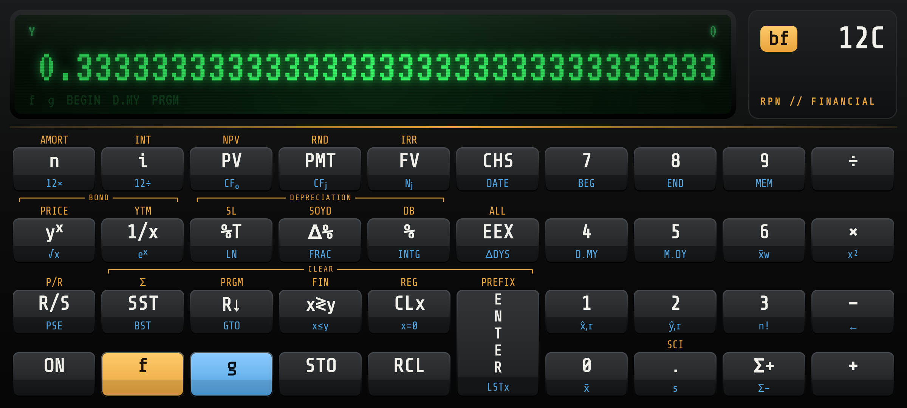
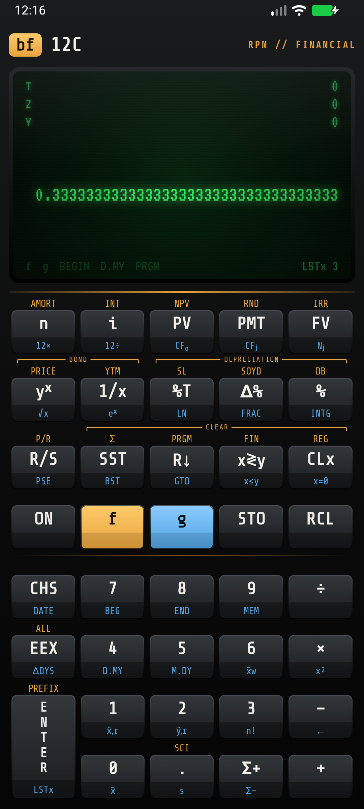
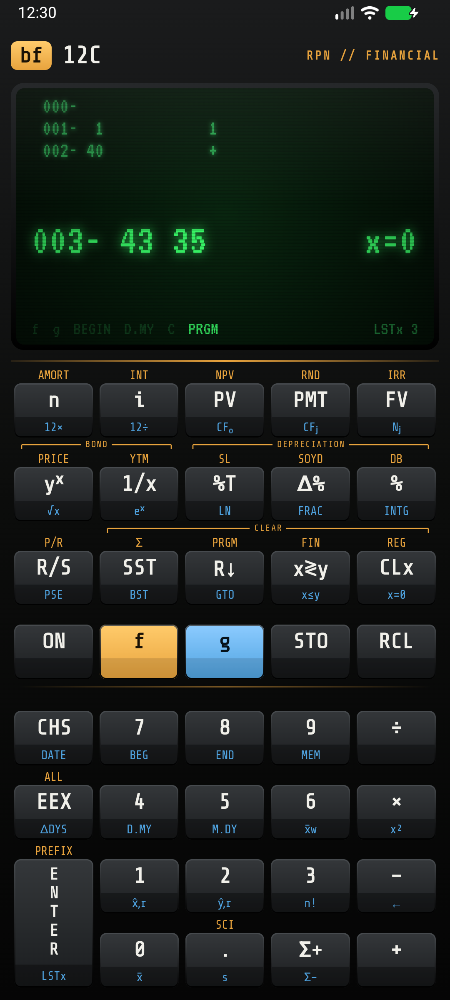
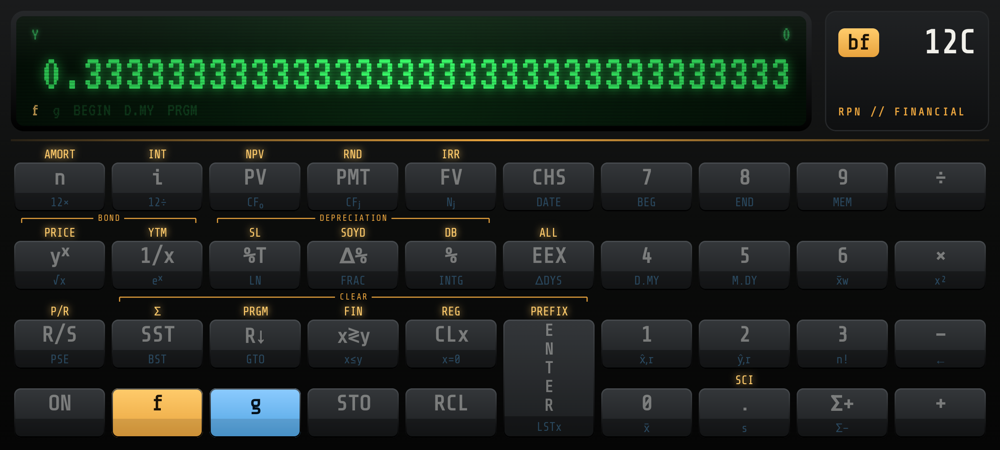
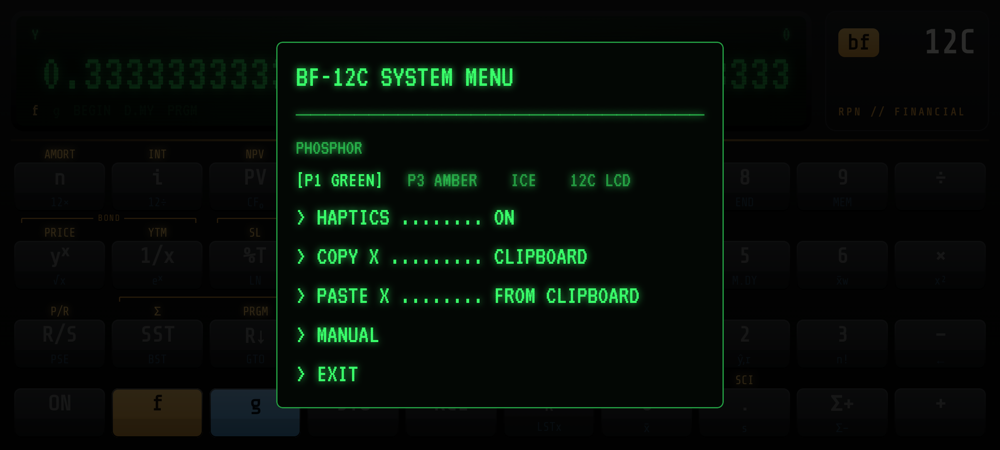

#  bf-12c

A hyper-modern Android calculator and homage to the HP-12C. Real RPN, the
real 12c keyboard, 34 significant digits, and an 80s green-screen display.
It shows up in the app drawer as **Calculator (bf-12c)**, so it sorts and
searches next to every other calculator, with a pocket-12c adaptive icon
(themed-icon ready).

<div align="center">
  
  <p><em><b>Landscape</b> — the real 4×10 keyboard, key for key</em></p>
</div>

<table>
  <tr>
    <td align="center" width="25%"><p><em><b>Portrait</b> · folded</em></p></td>
    <td align="center" width="25%"><p><em><b>Program mode</b></em></p></td>
    <td align="center" width="50%">
      <p><em><b>f shift</b> — gold legends light up</em></p>
      <p><em><b>ON</b> — green-screen system menu</em></p>
    </td>
  </tr>
</table>

## What it is

- **The 12c keyboard, key for key.** Landscape is the classic 4×10 layout:
  gold `f` legends above, blue `g` legends below, the tall ENTER, and the
  BOND / DEPRECIATION / CLEAR brackets. Portrait folds it in half, financial
  keys on top and the number pad at the bottom where your thumbs are.
- **RPN with a 4-level stack** (X Y Z T), LSTx, stack lift that behaves like
  the real thing, and continuous memory: everything survives restarts.
- **34 significant digits** in every register (BigDecimal, not doubles).
  `f EEX` shows ALL digits, `f 0`–`9` sets FIX, `f .` sets SCI. When the
  display is rounded, the full-precision value is shown beneath it.
- **The 12c function set:** TVM (n, i, PV, PMT, FV, BEGIN/END, 12×, 12÷),
  NPV / IRR with CF₀ / CFⱼ / Nⱼ, AMORT, simple interest, SL / SOYD / DB
  depreciation, bond PRICE / YTM, DATE / ΔDYS (D.MY and M.DY), statistics
  (Σ+, Σ−, x̄, s, x̄w, x̂,r, ŷ,r), %, Δ%, %T, yˣ, √x, eˣ, LN, n!, FRAC, INTG,
  RND, 20 storage registers with STO arithmetic.
- **Keystroke programming:** `f P/R`, 99 merged-keycode lines, `GTO`,
  `x≤y`, `x=0`, `R/S`, `PSE`, `SST` / `BST`. The listing shows the 12c
  keycodes *and* a readable mnemonic.
- **Modern touches:** swipe the display left to backspace (or `g −`),
  long-press to copy X, double-tap to paste. Paste understands numbers the
  way people copy them: `1,234.50`, `$1,000`, `(250.00)` (negative), `−3.5`,
  `12%`, `6.02e23`. A pasted value behaves like a recall, so `PV` after a
  paste stores it. The `ON` key opens a system menu with four phosphors:
  P1 green, P3 amber, ice, and a classic 12c LCD.
- **No permissions at all.** No network, no backups, no analytics.

## Install

Grab `bf-12c.apk` from the [latest release](../../releases/latest) and
sideload it. Every push to `main` publishes a single date-labeled release
(`vYYYY.MM.DD.N`) and deletes the previous one. Verify with the attached
`bf-12c.apk.sha256`.

Android 17 (API 37) or newer only — see `AGENTS.md` for the latest-only policy.

## Build

```sh
./gradlew lint test assembleDebug     # what CI runs (plus assembleRelease)
```

## Tests

The engine is pure Kotlin, so every test is a plain JVM unit test typed with
a tiny keystroke DSL (`"30 g n 6.5 g i 100000 PV 0 FV PMT"`, see
`app/src/test/.../engine/Keystrokes.kt`):

- `HandbookTest` — worked examples from the HP-12C Owner's Handbook, to the
  guard digits the handbook prints.
- `CalculatorTest` — every key and rule, plus a regression test for each bug
  fixed.
- `PropertyTest` — seeded randomized checks: TVM solves agree with each
  other, NPV at the IRR is zero, math and calendar identities, formatting
  round-trips, and a keystroke fuzzer (30,000 random keys, running programs
  included) that must never crash, stall or lose memory on save/restore.
- `FormatTest`, `ProgramParserTest` — display formatting, paste parsing,
  program-line merging, keycodes and mnemonics.
- `InvariantsTest` — the project rules: no Android in the engine, no
  permissions, no backups, CI actions pinned to SHAs, equal SDK levels.

GitHub Actions runs them on every pull request and push to `main`
(`.github/workflows/ci.yml`, one check each for unit tests and lint, with a
per-suite summary on the run page), alongside the build in
`build-release.yml`.

Signed release builds need all four of `BF12C_KEYSTORE_PATH`,
`BF12C_STORE_PASSWORD`, `BF12C_KEY_ALIAS`, `BF12C_KEY_PASSWORD` (or none, for
an unsigned build). CI restores the keystore from the
`BF12C_KEYSTORE_BASE64` secret.

## Credits

Fonts: [VT323](https://fonts.google.com/specimen/VT323) and
[Share Tech Mono](https://fonts.google.com/specimen/Share+Tech+Mono), both
under the SIL Open Font License (see `licenses/`). HP and HP-12C are
trademarks of HP Inc.; this project is an unaffiliated fan homage.
