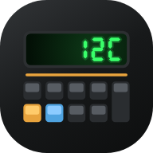
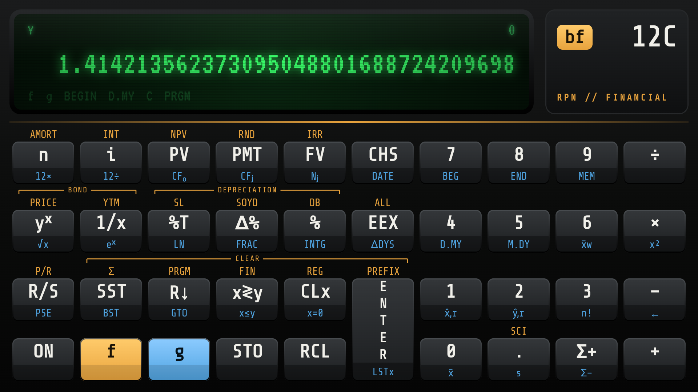
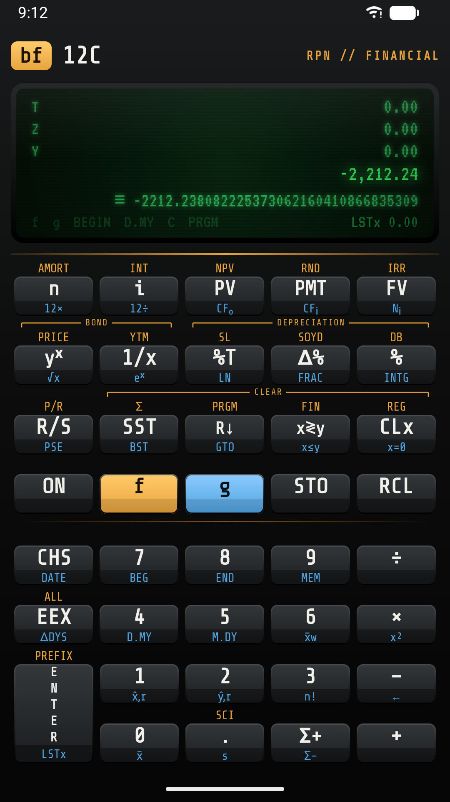
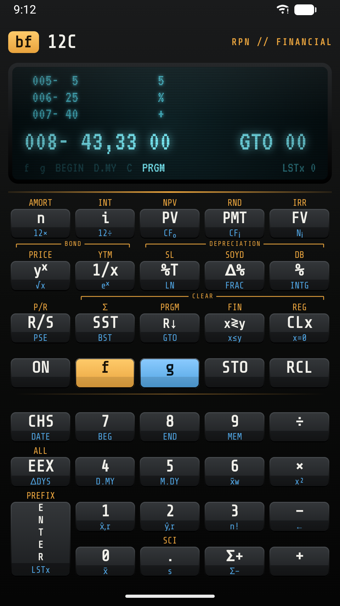
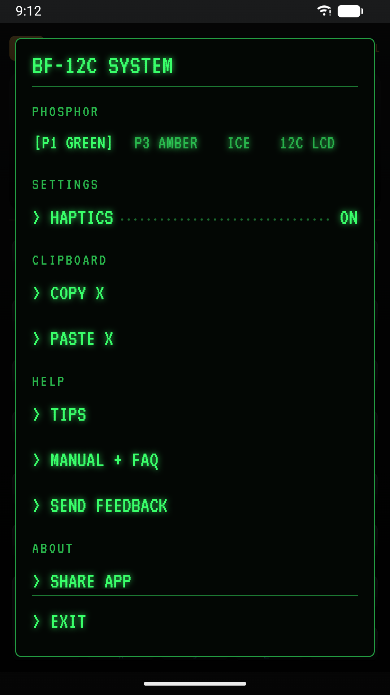
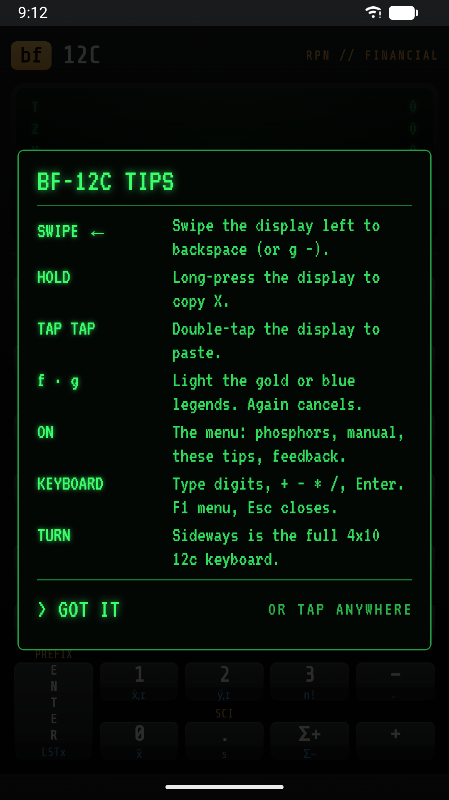
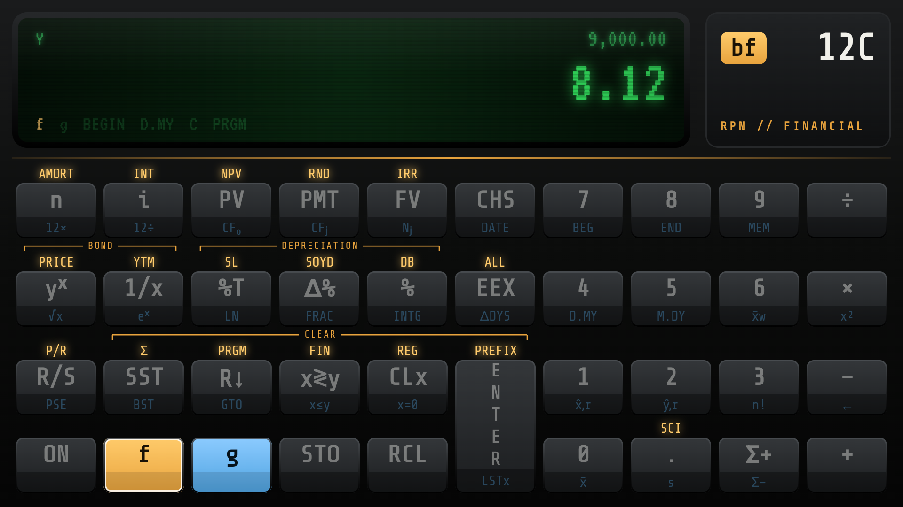
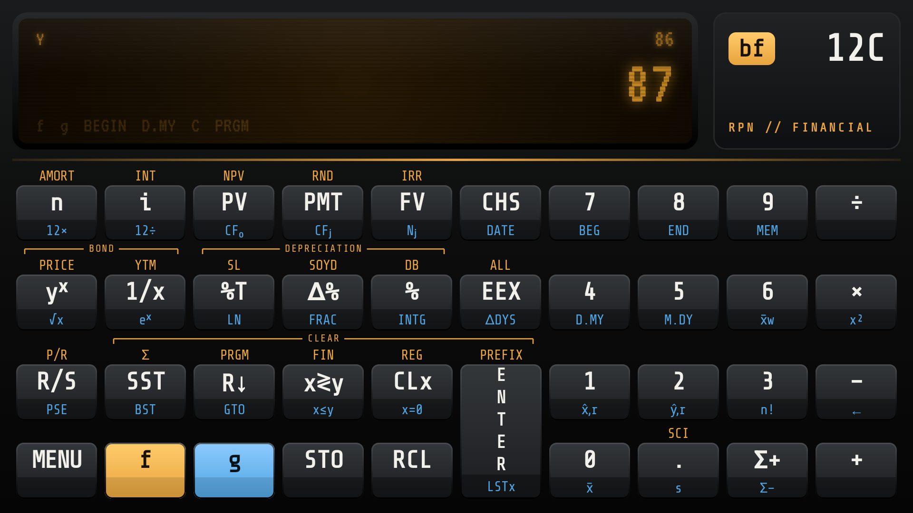
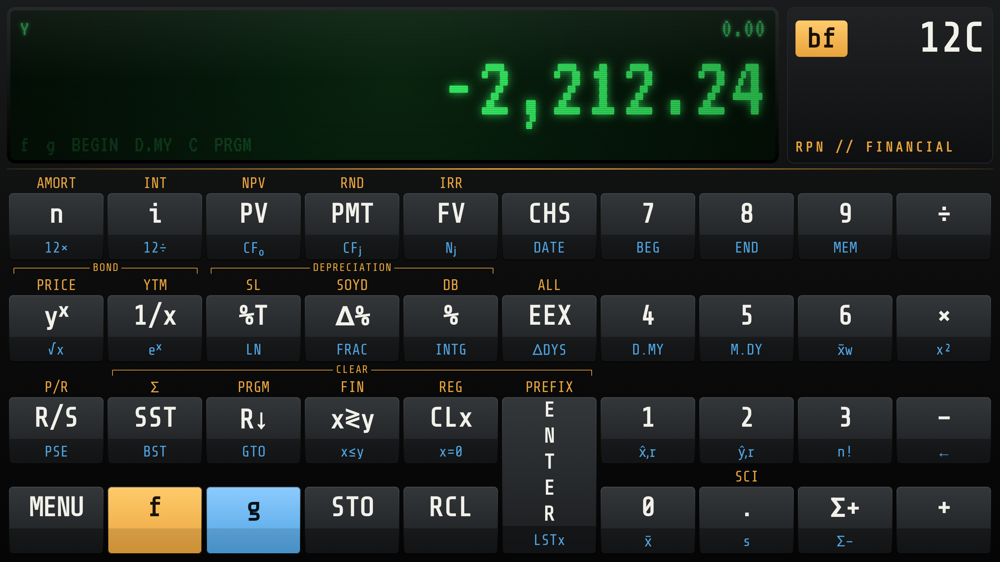

#  bf-12c

A hyper-modern Android calculator and homage to the HP-12C. Real RPN, the
real 12c keyboard, 34 significant digits, and an 80s green-screen display.
It shows up in the app drawer as **Calculator (bf-12c)**, so it sorts and
searches next to every other calculator, with a pocket-12c adaptive icon
(themed-icon ready).

<div align="center">
  
  <p><em><b>Landscape</b> — the real 4×10 keyboard, key for key</em></p>
</div>

<table>
  <tr>
    <td align="center" width="33%"><p><em><b>Portrait</b> · folded</em></p></td>
    <td align="center" width="33%"><p><em><b>Program mode</b></em></p></td>
    <td align="center" width="33%"><p><em><b>ON</b> — green-screen system menu</em></p></td>
  </tr>
  <tr>
    <td align="center" colspan="3">
      
      <p><em><b>First run</b> — one screen of tips, gone with a tap</em></p>
    </td>
  </tr>
  <tr>
    <td align="center" colspan="3">
      
      
      <p><em><b>f shift</b> — gold legends light up · <b>P3 amber</b>, one of four phosphors</em></p>
    </td>
  </tr>
</table>

<div align="center">
  
  <p><em><b>Tablet</b> — bigger legends, registers and menu; the layout follows the window</em></p>
</div>

## What it is

- **The 12c keyboard, key for key.** Landscape is the classic 4×10 layout:
  gold `f` legends above, blue `g` legends below, the tall ENTER, and the
  BOND / DEPRECIATION / CLEAR brackets. Portrait folds it in half, financial
  keys on top and the number pad at the bottom where your thumbs are.
- **RPN with a 4-level stack** (X Y Z T), LSTx, stack lift that behaves like
  the real thing, and continuous memory: everything survives restarts.
- **34 significant digits** in every register (BigDecimal, not doubles).
  `f EEX` shows ALL digits, `f 0`–`9` sets FIX, `f .` sets SCI. When the
  display is rounded, portrait shows the full-precision value beneath it.
- **The 12c function set:** TVM (n, i, PV, PMT, FV, BEGIN/END, 12×, 12÷),
  NPV / IRR with CF₀ / CFⱼ / Nⱼ, AMORT, simple interest, SL / SOYD / DB
  depreciation, bond PRICE / YTM, DATE / ΔDYS (D.MY and M.DY), statistics
  (Σ+, Σ−, x̄, s, x̄w, x̂,r, ŷ,r), %, Δ%, %T, yˣ, √x, eˣ, LN, n!, FRAC, INTG,
  RND, 20 storage registers with STO arithmetic.
- **Keystroke programming:** `f P/R`, 99 merged-keycode lines, `GTO`
  (`GTO nn` or `GTO . nn` from the keyboard),
  `x≤y`, `x=0`, `R/S`, `PSE`, `SST` / `BST`. The listing shows the 12c
  keycodes *and* a readable mnemonic.
- **Modern touches:** swipe the display left to backspace (or `g −`);
  with `f`, `g`, `STO`, `RCL` or `GTO` pending, backspace cancels just that
  prefix. Long-press to copy X, double-tap to paste. Paste understands numbers the
  way people copy them: `1,234.50`, `$1,000`, `(250.00)` (negative), `−3.5`,
  `12%`, `6.02e23`; a decimal comma like `1,5` is refused rather than
  misread. A pasted value behaves like a recall, so `PV` after a
  paste stores it. Pressing a lit `f` or `g` again cancels it (the lit
  key is ringed).
- **The ON menu.** Four phosphors (P1 green, P3 amber, ice, and a classic
  12c LCD), haptics, copy / paste, the tips again, a built-in manual and
  FAQ, **Share app** (the system share sheet with the Play link), **Rate on
  Google Play** (opens the Play listing), **Send feedback** (a new GitHub
  issue with the version and device filled in), the privacy policy and the
  version. Back or `Esc` closes it.
- **First-run tips.** One screen on the first launch teaches what the keys
  can't: swipe to backspace, long-press to copy, double-tap to paste, `f` /
  `g`, the ON menu, the keyboard shortcuts, and what the other orientation
  gives you. One tap anywhere dismisses it, and ON › TIPS brings it back.
  There is no rating prompt, review pop-up or "please share" nag, on
  purpose: rating and sharing are menu items, there when you want them.
- **Every screen.** Phones, tablets, foldables and Chromebooks, in split
  screen or a resizable desktop window. The layout follows the window, not
  the device; tablets and unfolded foldables print the legends, registers
  and menu bigger, and ultra-wide windows keep the keys in proportion.
  Nothing restarts on a fold, resize or display change. No touchscreen
  required: a mouse or trackpad presses keys too.
- **Hardware keyboard.** Digits, `.` (or `,`), `+ − * /` (`x` works too),
  `Enter`, `Backspace` (backspace), `Delete` (CLx), `f`, `g`, `e` (EEX),
  `^` (yˣ), `%`, `Ctrl+C` / `Ctrl+V` to copy / paste X, `F1` (or the Menu
  key) to open the ON menu and `Esc` to close it. In the menu, `Tab` and the
  arrows move a visible focus bar and `Enter` picks.
- **TalkBack.** Every key reads in words ("y to the x, f bond price, g
  square root"), or just the shifted function while `f` or `g` is lit.
  The display announces each result and offers Copy X, Paste and
  Backspace as actions. The ON menu and the tips are proper panes with
  headings, radio buttons and a switch, and every menu item is at least
  48dp tall.
- **No permissions at all.** No network, no backups or device-to-device
  transfer, no analytics. Share and feedback hand off to the share sheet
  and the browser; bf-12c itself never goes online.

## Latest Android, no compatibility code

bf-12c targets the latest public stable Android and the toolchain tracks
the latest Android Gradle Plugin and Gradle. It installs on Android 13 and
up, because that is the newest API the code uses (`BigDecimal.sqrt`), not
because it carries code for older phones: there are no version checks.
Full policy in [`AGENTS.md`](AGENTS.md).

## Install

bf-12c isn't publicly listed on Google Play yet. Until it is, grab
`bf-12c.apk` from the [latest release](../../releases/latest) and
sideload it. Every push to `main` publishes a single date-labeled release
(`vYYYY.MM.DD.N`) and deletes the previous one. The release also includes
`bf-12c.aab` and `mapping.txt` for Google Play. Verify the APK with the
attached `bf-12c.apk.sha256`.

Requires Android 13 or newer.

## Build

```sh
./gradlew lint test assembleDebug     # what CI runs (plus assembleRelease and bundleRelease)
```

### Screenshots

The README and Play screenshots are captures of the real app on an
emulator (see "Visual checks" in [`AGENTS.md`](AGENTS.md)), taken by
[`tools/screenshots/shoot.py`](tools/screenshots/shoot.py). It installs
the debug build, sets an exact 9:16 screen at each class's density, types
each scene on the calculator's own keys (with the first-run tips skipped)
and saves the raw captures in `build/screenshots/`. The README shots in
`docs/screenshots/` stay uncaptioned. Then
[`caption.py`](tools/screenshots/caption.py) (ImageMagick, in the app's
own fonts and colors) adds a headline and subline to each one for Google
Play and writes them into `fastlane/metadata/android/en-US/images/`, plus
the feature graphic:

```sh
./gradlew assembleDebug
tools/screenshots/shoot.py emulator-5554 phone   # also tab7, tab10
tools/screenshots/caption.py phone               # just re-caption (or feature)
```

The captions live in `CAPTIONS` at the top of `caption.py`.

Nothing in the app or its tests depends on it.

## Tests

The engine is pure Kotlin, so every test is a plain JVM unit test typed with
a tiny keystroke DSL (`"30 g n 6.5 g i 100000 PV 0 FV PMT"`, see
`app/src/test/.../engine/Keystrokes.kt`):

- `HandbookTest` — worked examples from the HP-12C Owner's Handbook, to the
  guard digits the handbook prints.
- `CalculatorTest` — every key and rule, plus a regression test for each bug
  fixed.
- `PropertyTest` — seeded randomized checks: TVM solves agree with each
  other, NPV at the IRR is zero, math and calendar identities, formatting
  round-trips, and a keystroke fuzzer (30,000 random keys, running programs
  included) that must never crash, stall or lose memory on save/restore.
- `FormatTest`, `ProgramParserTest` — display formatting, paste parsing,
  program-line merging, keycodes and mnemonics.
- `InvariantsTest` — the project rules: no Android in the engine, no
  permissions, touchscreen optional, no backups or device transfer, no
  review API or prompts, store links only in `Links.kt`, no email
  addresses, CI actions pinned to SHAs, compileSdk
  matching targetSdk, and no `SDK_INT` checks.
- `LinksTest` — the Share, Rate and Send feedback strings: the Play and
  market links match the release application ID and the issue URL is well
  formed.

GitHub Actions runs them on every pull request and push to `main`
(`.github/workflows/ci.yml`, one check each for unit tests and lint, with a
per-suite summary on the run page), alongside the build in
`build-release.yml`.

Signed release builds need all four of `BF12C_KEYSTORE_PATH`,
`BF12C_STORE_PASSWORD`, `BF12C_KEY_ALIAS`, `BF12C_KEY_PASSWORD` (or none, for
an unsigned build). CI restores the keystore from the
`BF12C_KEYSTORE_BASE64` secret.

## Credits

Fonts: [VT323](https://fonts.google.com/specimen/VT323) and
[Share Tech Mono](https://fonts.google.com/specimen/Share+Tech+Mono), both
under the SIL Open Font License (see `licenses/`). HP and HP-12C are
trademarks of HP Inc.; this project is an unaffiliated fan homage.
